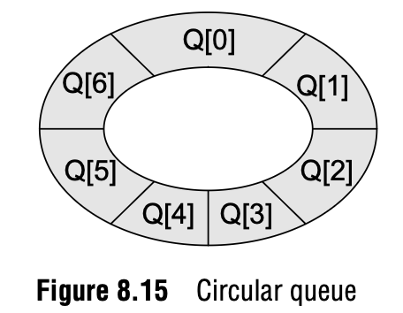
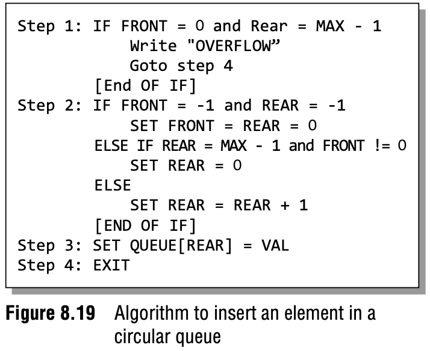
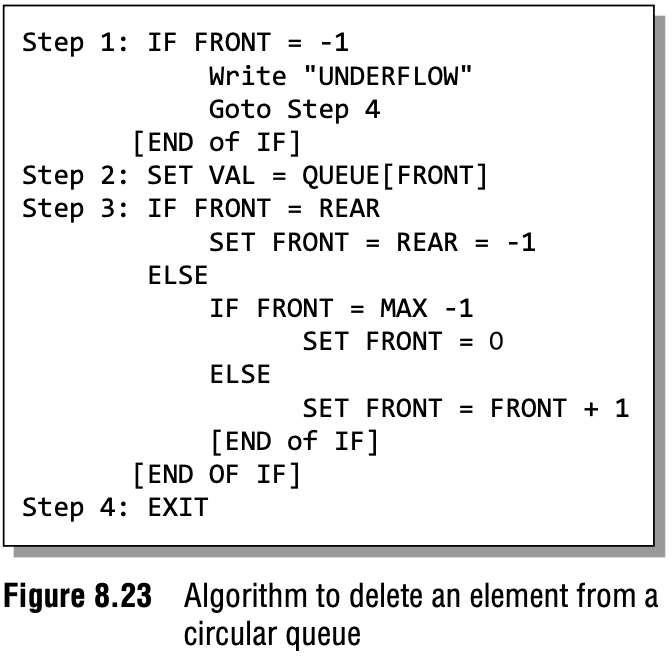

# 8.4.1 Circular Queues

## What is it?

- Created to solve the overflow issue that arises with linear queues 

 
- The circular queue will be full only when FRONT = 0 and REAR = Max – 1.
- The implimentation is the same aside from the method used to insert and elete

## Insertion and Deletion Algorithms

**Insertion** 

 
**Deletion** 

 

## Program

